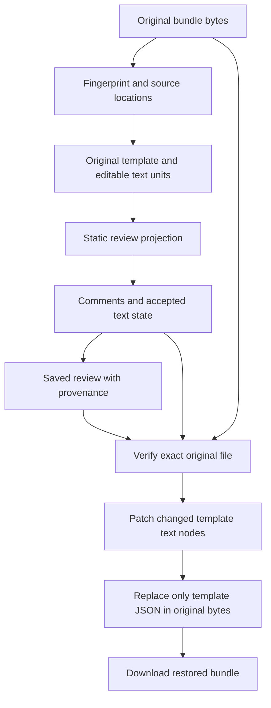

# Restoring an edited HTML bundle: research report

Date: 2026-09-16. Repository baseline: `fca9966073ced86084b3a6eb8af3ddbc9ebc3460`.

Status: historical research and design recommendations, supported by a bounded synthetic browser experiment. The feature has since been implemented; see the [implementation specification](bundle-roundtrip-implementation.md) and [production validation record](testing.md). The experiment results below remain the original research observations.

The subsequent [implementation specification](bundle-roundtrip-implementation.md) fixes the data model, algorithms, limits, compatibility rules, and acceptance tests. Its decisions take precedence over recommendations and open choices in this report.

## 1. Feasibility and recommended direction

Restoring the supported kind of HTML bundle after review is feasible. Preserve the original file, track accepted text changes independently of comments, and patch the original embedded template. Retain the surrounding bundle, runtime, resource identifiers, and asset payloads. Its own bootstrap can then assemble the revised document when the exported file is opened.

This is a source-preserving export feature, not an inverse of the current static conversion. The current conversion deliberately discards runtime information and changes document structure. Attempting to infer that discarded information from the review DOM would be unreliable.

Recommended first release:

- Support the existing bundle profile, with an additional, stricter eligibility check for reliable source mapping.
- Allow the reviewer's existing plain-text replacements and deletions. Keep its existing rule that replacements stay within one review block.
- Keep static revised HTML and annotated-review downloads available as separate actions.
- Cache the original bytes during the active session. Saved reviews retain a source fingerprint, template, and edit model; after reopening, require the exact original file for restored export.
- Use source locations from a standards-oriented HTML parser to patch text nodes and the template data block, without serializing the entire original document.
- Give new reviews with restoration metadata a versioned format. Continue reading existing reviews without promising restoration for them.
- Preserve Chromium/Firefox review support and the documented Safari interaction limitation.

The largest work item is durable text identity across annotation changes, saves, and reopens. Updating the bundle's JSON string is comparatively small. This is a substantive model and persistence change, not just another download button.

## 2. Evidence and limits of this research

The investigation used repository code, existing synthetic fixture generators, primary technical sources, and a new [reproducible research probe](../scripts/research/bundle-roundtrip.mjs). It made no changes to production application code or dependencies.

The probe demonstrates targeted template editing, preservation of the surrounding source, and successful execution of an independently authored miniature bundle runtime after export. It also checks the actual application's importer and comment-removal behavior. It does **not** implement durable mapping, an edit model, version migration, cancellation, or a complete exporter. Its synthetic runtime is not a substitute for validating every supported producer/runtime version.

No producer SDK or official producer round-trip contract is established by the repository or the sources cited here. Format support is currently the explicit profile in [the importer specification](bundle-import-implementation.md). Claims about restoring behavior must therefore be scoped to validated bundles, rather than arbitrary HTML applications with similarly named data blocks.

## 3. What the application currently retains and loses

Function names below refer to [index.html](../index.html); use names rather than fixed line numbers when implementing.

| Integration point | Current behavior | Consequence for restoration |
| --- | --- | --- |
| `readFile` | Reads bytes, decodes the file, detects the format, then clears the source string before bundle conversion. | Capture original bytes and identity before they are discarded. Current decoding is permissive, so it cannot establish byte-preserving export eligibility. |
| `bundleImporter.detect` | Returns marker text, without source locations. | Add independently verified bounds for the original template block. |
| `bundleImporter.convert` | Reads the template JSON and manifest; embeds image/font data; ignores runtime payloads. | Keep the original resource references and runtime outside the rendered review model. Assets need not be recompressed for text changes. |
| Conversion normalization | Removes scripts and other nodes, moves safe head content and header/footer slots, changes table aliases, and injects static layout CSS. | Source identity must be established before these transformations and carried through them. Final review DOM paths do not identify original template paths. |
| `sanitizeDocument` | Reparses markup, removes executable attributes and reserved incoming `data-hr-*` attributes, adds review CSP/styles. | A mapping attached before this step may disappear. Establish an explicit trusted metadata boundary instead of simply allowing incoming attributes. |
| `submitComment` | Splits text nodes, wraps pieces in marks, stores `originalParts`. | Mark IDs identify comments; they do not identify original text nodes. |
| `setDecision` | Writes replacement into the first marked part and empties subsequent parts; undo restores original pieces. | The restored source must follow exactly the same formatting and text distribution rule. |
| `deleteComment` | Removes marks and normalizes adjacent text nodes. Accepted wording remains, but its comment record is deleted. | Replaying surviving accepted comments would silently lose legitimate edits. |
| `reviewSnapshot` / `validatePayload` | Save and accept a fixed set of v1 document/comment/view fields. | New provenance fields require explicit serialization and validation changes; adding unused fields to import results is insufficient. |
| `exportClean` | Removes annotations from the current static DOM. | This remains a static export, with no original bootstrap or original component layout engine. |

An accepted replacement can be removed as an annotation and then annotated again. That sequence makes a durable text model necessary even if the initial implementation only supports simple replacements.

## 4. Define what “restored” guarantees

The future specification should distinguish these contracts:

1. **No final text changes:** return the exact original bytes, including BOM, line endings, and source formatting. Resolving comments or accepting and then undoing an edit does not change the file.
2. **Text changes:** preserve the original outer file byte-for-byte before and after the template block's content. Inside the decoded template, preserve everything outside changed, validated text-node source spans. Preserve original manifest/resource payloads exactly.
3. **Changed text nodes:** preserve their intended characters and surrounding elements. Entity spellings and newline spelling inside a changed node may be normalized. This is a deliberately narrower promise than preserving every source character within that node.
4. **Behavior:** retain the original bootstrap, component definitions, scripts, styles, resource references, and slot attributes. Validate that supported runtimes still render and behave correctly.
5. **Review cleanup:** the final bundle contains no reviewer-added comments, marks, metadata, or application UI. Existing source comments and original bundle metadata remain part of the original document.

Do not promise identical page breaks after changing text, pixel-identical rendering between browsers, editability in an originating authoring application, preservation of a digital signature over changed content, or restoration of arbitrary generated application state.

Keeping runtime bytes unchanged does not prove every runtime will accept changed text. A runtime might validate a template checksum, depend on specific text, contain a precomputed search index, or display an embedded thumbnail. Such derived data can become stale. The first release should not silently regenerate unknown caches or signatures; supported producer profiles need explicit coverage or exclusions.

## 5. Alternatives evaluated

| Approach | Benefit | Problem | Recommendation |
| --- | --- | --- | --- |
| Rebuild the original bundle from the static review DOM | Uses existing export machinery. | Removed scripts, manifest entries, original slots, and runtime structure cannot be recovered. | Reject. |
| Replace matching quoted text in the original file | Small amount of code. | Repeated passages, entities, JSON escapes, inline formatting, and subsequent edits make matches ambiguous. Can target script or asset text. | Reject. |
| Preserve the original, patch its parsed template, serialize all HTML | Easier DOM manipulation. | Broad lexical changes; HTML tree repair and parser modes can change structure. Reserializing the outer file also touches unrelated runtime content. | Useful prototype, insufficient for the proposed preservation contract. |
| Preserve the original and patch validated text-node source spans | Changes are narrow and auditable; runtime and assets remain intact. | Requires source mapping, eligibility validation, durable text state, and an HTML parser with locations. | Recommended. |
| Use an official producer import/export API | Could handle pagination caches, signatures, and authoring metadata. | No such integration is established here; could introduce a server or additional distribution requirements. | Reconsider if a documented API becomes available. |

Browser parsing and serialization are not inverse operations on source bytes: HTML parsing normalizes newlines, resolves character references, and repairs trees; serialization emits a representation of the resulting tree. These are reasons to retain source bytes and narrow the edited regions. [WHATWG HTML parsing and serialization](https://html.spec.whatwg.org/multipage/parsing.html#serialising-html-fragments)

## 6. Proposed data flow and source identity



### Source retention

Keep a SHA-256 fingerprint of the complete original byte sequence, its byte length, an encoding/profile identifier, a template fingerprint, and a mapping/conversion version. The filename is a display hint, never an identity check. On reattachment, accept a renamed file whose bytes match; reject a similarly named file with different bytes.

Web Crypto provides `digest` for SHA-256. This can identify the expected original; it does not authenticate the review or its author. Feature-detect it and validate both local-file and served operation. The research probe successfully used it from local files in Chromium and Firefox. [Web Cryptography digest operation](https://www.w3.org/TR/webcrypto/#SubtleCrypto-method-digest)

| Storage choice | Sharing experience | Cost |
| --- | --- | --- |
| Original retained only in memory; fingerprint/template/edit model saved | Recipients can review immediately. Restored export after reopening asks for the original. | No duplicate original assets/runtime in each annotated copy. Original owner can perform the final export. |
| Entire original embedded as inert bytes | Any recipient can restore without another file. | Significant duplication alongside the static document; encoded bytes also grow. Existing 64 MiB download/reopen limits become a constraint. |
| Separate source sidecar distributed with every review | Avoids putting everything inside one file. | More files to manage and associate; weakens the existing portable review experience. |

Recommend the first option initially. Preserve the original in the active session for immediate export, but do not rely on browser storage or object URLs to persist it. A later explicit “include original” option can be added with measured size limits.

### Encoding contract

Recommend restored export initially for strictly decoded UTF-8 bundles, with or without a UTF-8 BOM. Continue the existing review/static-export path for other encodings. Retain original bytes even when a decoded string is available; use fatal decoding for eligibility and explicitly preserve BOM handling.

Parser offsets address a JavaScript string, while the final preservation contract addresses bytes. Keep these coordinate systems separate. For eligible UTF-8, compute a small number of byte offsets from encoded prefixes, accounting for BOM removal; splice original byte slices with the UTF-8 encoding of the new JSON. Do not apply string offsets directly to a byte array or compute prefix lengths independently for every text unit.

The Encoding Standard exposes fatal decoding and BOM handling and defines `TextEncoder` as UTF-8. The current permissive decoding fallback should not be reused as proof that the original bytes can be reconstructed. [WHATWG Encoding interfaces](https://encoding.spec.whatwg.org/#interface-textdecoder)

## 7. Source locations and mapping through conversion

`parse5` is a credible candidate. Its `sourceCodeLocationInfo` option provides node locations; implicitly created elements can lack locations. Its `scriptingEnabled` setting affects `noscript` parsing. Location records include element start/end-tag bounds, which can delimit the template block without a regular expression. [parse5 parser options](https://parse5.js.org/interfaces/parse5.ParserOptions.html), [element locations](https://parse5.js.org/interfaces/parse5.Token.ElementLocation.html)

A probe bundled `parse5` 8.0.0 and its resolved `entities` 6.0.1 dependency into a browser IIFE with esbuild 0.28.2. The minified parser-only result was **178,551 bytes** and executed in both target browsers without Node shims. This is an experimentally evaluated candidate version, not a claim that it is the latest release. The packages' MIT and BSD-2-Clause notices must accompany any eventual distribution.

Adopting that parser would change the previous implementation's “no runtime dependencies / no build step” development constraint. Recommended specification decision: permit a pinned, reproducibly generated inline parser artifact, while preserving the one-file, offline application distributed to users. Do not fetch the parser from a CDN at runtime. The parser artifact, license notices, build command, and verification of regenerated output would become deliverables.

Recommended mapping procedure:

1. Parse the original wrapper and locate exactly one eligible template data block with explicit source bounds. Ignore apparent markers in comments, attribute values, script literals, and inert template contents. Reject ambiguous or mode-dependent discovery.
2. Decode the template JSON and parse its original markup with source locations. Assign stable IDs to eligible source text units before any conversion.
3. Compare the relevant parser tree with the browser's inactive parse structurally: node types, namespaces, ancestry, and text values. Never correlate two flat text-node lists merely because their lengths match.
4. Carry IDs through element replacement and moves. Removing an executable node removes its content from the review projection. Moving a header/footer retains its original source identity. Table aliases keep their underlying text-unit identities.
5. Account explicitly for serialization, sanitization, and iframe reparsing. Adjacent source text nodes can merge after a removed element disappears. A rendered text run may therefore need several source-unit segments.
6. Validate the resulting projection before committing import. No visible editable text may be accidentally attributed to a different unit. Reviewer-generated text has no editable source unit.

Use sidecar projection records rather than extra visible spans around every text node. Such spans could alter CSS, selection, and layout. The specification must define reconstruction after reopening and empty-unit handling; a `WeakMap` alone cannot survive serialization.

### Source locations need eligibility checks

The probe parsed this synthetic input:

```html
<table>Before<tr><td>Cell</td></tr>After</table>
```

The parser produced a text node `BeforeAfter` outside the table. Its reported source span was `Before<tr><td>Cell</td></tr>After`. Replacing that entire span as if it were plain text would delete table markup.

Therefore require every editable unit to have a contiguous, nonoverlapping source span that is validated as text in its original parsing context and decodes to the expected value. Exclude ambiguous repaired structures from restoration eligibility, while still allowing static review. The probe's simple fragment check is demonstration code, not a sufficient general validator.

Special handling or exclusion is needed for leading newlines in `pre`, raw-text/RCDATA contexts, `noscript`, `template` contents, foreign SVG/MathML content, null-character repair, and malformed formatting. Recommend a conservative first profile limited to ordinary HTML body text, supported table text, and supported header/footer text. Add specialized contexts only with explicit parsing rules and tests.

Scripting mode deserves its own check: the inactive review parse and the original runtime's parsing method may differ. Do not assume that the setting appropriate for locating outer scripts is necessarily appropriate for the runtime's template. If the editable structure changes under the relevant modes, disable restored export for that bundle.

## 8. Durable text state, separate from annotations

Recommended conceptual model:

| Record | Responsibility |
| --- | --- |
| Immutable source | File/template fingerprints, original template, profile and mapping versions. |
| Text unit | Stable source ID, validated original span, original decoded text, and current accepted text. |
| Projection | Maps rendered text runs to units and current character ranges, including runs merged by reparsing. |
| Annotation | Note, suggestion, decision, and ranges attached to the text model. Original selected text remains available for undo. |

These are proposed responsibilities, not a finalized JSON schema. Store only one authoritative copy of accepted text state; do not let DOM mutations, a separate patch list, and comments become three competing sources of truth.

Required semantics:

- A pending or rejected suggestion never changes accepted text state. Preview derives a temporary projection.
- Acceptance modifies the text units; for a selection across inline formatting, insert the replacement in the first selected unit and delete selected portions from the following units, matching current behavior.
- Undo restores the affected text and updates dependent ranges.
- Removing an accepted annotation keeps accepted text state. Removing a pending annotation removes only its proposal.
- A later annotation may edit the retained wording after the earlier annotation has been removed.
- Rebase ranges for other disjoint annotations when text length changes. Define insertion-boundary affinity and ordering explicitly.
- Retain logical zero-length units/anchors for deletions and undo, even when no ordinary text node remains after save/reparse.
- Keep current overlap restrictions, but enforce them in the model as well as through DOM marks. Empty deletion anchors need an explicit rule.
- Validate that saved/reopened document text agrees with the accepted text model. On disagreement, reject the affected review rather than guess which representation is correct.

This approach lets export compare each unit's final accepted text with its original text. It does not need to replay a vanished comment or reverse all historical operations. A full collaborative operation log or CRDT is unnecessary for the existing one-copy-at-a-time workflow.

Use explicitly named **UTF-16 code-unit** offsets for integration with DOM text operations. The DOM Standard uses code units for character-data operations. W3C annotation selectors offer useful context/quote concepts, but their text positions use Unicode code points; they cannot be copied into this schema without conversion. Quote/context may validate an anchor, but must never authorize an ambiguous automatic replacement. [DOM character data](https://dom.spec.whatwg.org/#interface-characterdata), [W3C text selectors](https://www.w3.org/TR/annotation-model/#text-quote-selector)

Do not normalize Unicode content. Validate scalar boundaries so edits cannot split a surrogate pair. The final specification must also choose and test a grapheme-boundary policy for combining marks and emoji sequences; rejecting a split is preferable to silently widening the user's selection.

## 9. Export algorithm and validation

Recommended sequence:

1. Refuse export while a draft or incompatible import/export operation is active. Freeze the review revision used for export.
2. Obtain original bytes from the active session or a file picker. Check byte length, SHA-256, encoding eligibility, and template identity. Recompute source locations from that verified original.
3. Validate the saved model, source spans, projection, decisions, and bounds. If any required mapping is invalid, fail the entire restored export; do not partially apply edits.
4. If every unit equals its original text, download the original byte sequence directly.
5. For changed units, produce plain-text HTML encoding appropriate to the supported context. Patch whole validated text-node spans, applying nonoverlapping replacements from the end toward the beginning, or assemble once from sorted spans.
6. Reparse the changed template. Verify that unchanged structure and resources remain intact and that changed units have exactly the intended characters. This catches context-sensitive cases such as ignored leading newlines.
7. Serialize the complete updated template as a JSON string with HTML-script-safe escaping. Replace only the contents of the original template data block, preserving its original start/end tags and everything outside it.
8. Validate the resulting bundle data and size without running its bootstrap. Construct the download from original byte slices plus the replacement bytes. Use the established download mechanism and retain review state on failure/cancellation.

Two encodings are required: replacement characters must first be safe as HTML **text**, and the resulting template must then be safe as JSON inside a script data block. `JSON.stringify` alone does not make arbitrary content safe for embedding in HTML. Escape literal `<` in serialized JSON as `\u003c`; retain the application's handling of U+2028/U+2029. Do not use JavaScript-only `\x3c` escapes in JSON. HTML's script parser treats sequences such as closing script tags specially even when the block contains data. [WHATWG script-content restrictions](https://html.spec.whatwg.org/multipage/scripting.html#restrictions-for-contents-of-script-elements)

Patch **final text-node values**, rather than attempting to translate every character offset through the original entity syntax. For example, decoded `&` may originally occupy five source characters as `&amp;`, and one named reference may decode to multiple code points. The chosen preservation contract allows a changed text node to be safely re-encoded while leaving other source spans untouched.

Manifest assets are untouched for this scope. Their existing compression, ordering, MIME fields, resource IDs, and encoded bytes remain as supplied. Do not decode and re-encode runtime assets to perform text export.

## 10. Isolation, persistence, and compatibility

The reviewer must continue to treat input scripts as inert data. Preserve the current document-frame sandbox and CSP. Keep original source bytes, template scripts, and model metadata outside live rendering. Do not attach the original bundle to a temporary script-enabled iframe as part of ordinary export validation.

The restored download intentionally contains the original runtime. Opening it as a standalone file restores that runtime's behavior, including any original actions or resource requests. Its UI description should state that clearly; it is a different output from revised static HTML. It must not silently replace the existing static-export action. [HTML iframe sandbox](https://html.spec.whatwg.org/multipage/iframe-embed-object.html#attr-iframe-sandbox)

Recommended actions: “Save annotated review,” “Export revised static HTML,” and “Export original-format HTML.” Use a short unavailable-state explanation when mapping or original-source data is missing. Export accepted wording even if some comments remain open; identify that pending suggestions are excluded. Do not require every informational comment to be resolved first.

Recommend a v2 saved-review format for reviews with restoration data. The current v1 validator reconstructs a whitelist of fields and would discard unknown metadata if v1 were reused carelessly. New code should read v1 and v2; existing v1 applications should reject v2 explicitly rather than resave it without provenance. Saved copies embed their application code, so normal direct opening uses their matching reader.

Existing v1 reviews remain valid for annotation and static export. Supplying an original file does not automatically repair missing provenance: accepted edits whose comments were removed no longer have reliable original anchors. Exclude automatic legacy restoration from the first release. A future migration would require separately validated reconciliation, not quote matching.

Version the conversion/mapping behavior as well as the payload. Reopening must not silently reinterpret old mapping data using a newer conversion that reorders or removes different content. The specification must choose supported mapping versions and explicit failure behavior.

## 11. Performance and size implications

Keep the existing 64 MiB input/download, 2 MiB template, and 48 MiB normalized-document ceilings unless a later specification deliberately changes them. Both the edited template and every downloadable output need checks. The saved review includes application code, static embedded resources, template/model metadata, and escaping overhead; an acceptable imported file is not proof that its annotated output will fit.

The parser-only browser artifact adds about 174 KiB to every embedded reviewer copy. Embedding original source would add a second copy of assets/runtime on top of the existing normalized document; base64 alone adds approximately one-third to stored byte size before surrounding metadata. This supports the proposed reattachment workflow.

A location-enabled parse of the 18,314,105-byte synthetic bundle took 575/726 ms in Chromium and 603/591 ms in Firefox across two successful probe runs. These few samples are not performance guarantees and exclude the full new workflow. A synchronous parser cannot be made interruptible merely by wrapping it in a promise.

Recommend a dedicated worker for location parsing and export validation. Cancellation can terminate the worker. That requires a deliberately scoped worker allowance in the **outer application** CSP, a locally embedded worker/parser artifact, and tests for offline operation. It does not require relaxing the reviewed document's CSP or sandbox. An incremental parser with explicit yields is an alternative only if its cancellation behavior is demonstrated.

The implementation specification must set numeric bounds for text-unit count, projection/model size, worker memory, and export timeout after representative measurements. Include peak memory from original bytes, decoded strings, parsed trees, normalized assets, saved payloads, and worker transfers. Avoid sending unnecessary copies of the full manifest between threads. Preserve import's current all-or-nothing state transition and latest-operation-wins behavior.

## 12. Experimental results

The [probe](../scripts/research/bundle-roundtrip.mjs) contains deliberately restricted source-patching code and uses the existing actual importer/UI where noted. No production exporter is exercised because none exists yet.

| Probe | Result |
| --- | --- |
| No-change source path | Returns the identical original source string. Exact-byte handling across encodings/BOM remains a future implementation test. |
| Edited template splice | Original prefix and suffix outside the data block compare exactly; repeated passages are targeted separately. |
| Markup-looking replacement | A replacement containing script-tag text, ampersand, emoji, and combining characters renders literally. No injected script runs. |
| Inline formatting | Changes to separate bold/italic text nodes retain their original enclosing tags. Full annotation-to-source mapping is not implemented by the probe. |
| Actual import of the edited bundle | Existing importer converts it and retains the expected replacement. Original bootstrap does not execute in the reviewer. |
| Standalone original and exported bundle | Synthetic custom element initializes, embedded PNG decodes, and the original button interaction works in both browsers. |
| Accepted annotation removal | Actual UI preserves edited wording and saves zero comments, confirming that comments alone cannot reproduce final text. |
| Native/parser tree comparison | Eight synthetic cases per browser agree under the tested inactive parsing mode, including entities, preformatted newlines, table aliases, removed-script adjacency, malformed table text, `noscript`, malformed formatting, and SVG. Agreement does not make all cases export-eligible. |
| Malformed-table source span | Demonstrated that one text node's location can span intervening markup. Requires rejection or specialized mapping. |
| File-origin SHA-256 | Available and returns a 32-byte digest in both browsers. |
| Network/runtime diagnostics | Zero external HTTP(S) requests and zero page exceptions in each successful run. |

Test environment: Node.js 22.23.2; Playwright 1.57.0; Chromium 143.0.7499.4 and Firefox 144.0.2; the reference machine documented in [testing.md](testing.md). WebKit/Safari was not tested for this research feature. Existing review limitations remain applicable.

### Reproduction

Use the repository's existing test setup and Node.js 22 or later. Install the research-only parser/bundler into a temporary directory; this does not modify the application's package files:

```sh
research_deps=$(mktemp -d)
npm install --prefix "$research_deps" --package-lock --ignore-scripts --no-audit --no-fund --save-exact parse5@8.0.0 entities@6.0.1 esbuild@0.28.2
RESEARCH_DEPS_DIR="$research_deps" node scripts/research/bundle-roundtrip.mjs
```

The probe prints JSON results and writes synthetic standalone files/results to a new operating-system temporary directory. It deliberately uses a tiny authored runtime and narrow text-node cases. It is outside the Playwright test-file pattern and does not change `npm test` coverage. It should not be copied into production as an exporter or validation implementation.

## 13. Required test matrix for the implementation specification

These are proposed acceptance tests, **not completed feature tests**. Use newly authored synthetic documents, explicit expected output, and a functional synthetic bundle bootstrap. Existing fixtures intentionally include a nonfunctional runtime payload for import-only validation, so they cannot by themselves establish restored runtime behavior.

| ID | Scenario | Required assertion |
| --- | --- | --- |
| R01 | No annotations; resolved notes only; accept then undo | Export equals original bytes, including BOM/newlines. |
| R02 | Mixed open/accepted/rejected/resolved comments | Only final accepted wording appears; pending preview does not leak into export. |
| R03 | Accepted annotation removed | Wording survives export, save/reopen, and subsequent editing. |
| R04 | Two identical passages; duplicated IDs | The intended source unit changes exactly once; no quote-based guessing. |
| R05 | Several edits in the same source text node | Adjacent and different-length edits produce expected final text regardless of decision order; disjoint anchors remain correct. |
| R06 | Selection across bold/italic/link boundaries | Same insertion/deletion and formatting semantics as the current reviewer; unrelated tags/attributes unchanged. |
| R07 | Empty replacement and complete-node deletion | Empty units/anchors survive round trips and undo; no accidental loss of neighboring content. |
| R08 | Accept, remove annotation, revise replacement, reject/undo later revision | Final text and remaining undo state are correct after each step. |
| R09 | Header/footer movement and table aliases | Edits target original slots and aliases; restored output contains original structure rather than static substitutes. |
| R10 | Removed element between text nodes; `normalize()`; iframe reparse | Merged/split rendered runs retain correct segment provenance. |
| R11 | Entity variants, multi-code-point entities, CRLF, leading `pre` newline | Correct decoded text; unsupported contexts rejected; no unit/byte offset confusion. |
| R12 | Emoji, surrogate pairs, combining marks, ZWJ, RTL | Explicit offset/grapheme policy; no Unicode normalization or split scalars. |
| R13 | Less-than, ampersand, quote, backslash, closing-script text, U+2028/U+2029 | Correct two-layer escaping; literal text; no new executable content or broken JSON. |
| R14 | Comments/attributes/scripts/inert templates containing marker-like text | Exactly the real data block is located; duplicates/ambiguities rejected. |
| R15 | Malformed table/formatting, implicit elements, overlapping locations | No markup is overwritten by a text patch; restoration eligibility fails deterministically. |
| R16 | Different `noscript` parsing modes, raw text, foreign content | Only explicitly supported context is editable/exportable; no source/parser disagreement accepted. |
| R17 | Asset/runtime/manifest preservation | Byte equality outside the replaced JSON block; asset hashes, script payloads, resource references, and unknown outer content unchanged. |
| R18 | Source reattachment | Matching renamed file succeeds; changed byte, wrong file, wrong encoding, and stale template fail without changing review state. |
| R19 | Tampered metadata/model/anchors | Invalid IDs, ranges, lengths, versions, decisions, collisions, or model/DOM mismatch are rejected; digest is not treated as a signature. |
| R20 | Save/reopen portability | At least three cycles, direct file opening and Open HTML, fresh offline contexts, creator context closed; provenance and all decisions retained. |
| R21 | v1 and v2 compatibility | v1 static workflows continue; v1 restoration unavailable; old reader rejects v2; supported mapping versions behave explicitly. |
| R22 | Restored bundle reimport | Starts a new review of the edited document with no prior reviewer metadata; fresh restoration cycle works. |
| R23 | Script isolation during import/save/export | Neither cached original runtime nor template scripts execute; existing frame sandbox/CSP remain unchanged. |
| R24 | Standalone runtime checks | Authored bootstrap, component initialization, fonts/images, links, and interaction work after export. Compare against original baseline. |
| R25 | Runtime-derived data and newly introduced template syntax | Known checksums/caches/signatures either have supported handling or cause explicit ineligibility. Replacement text introducing unsupported interpolation syntax cannot bypass profile validation. No universal fidelity claim from marker recognition alone. |
| R26 | Drafts, cancellation, failure, and competing operations | No partial download/state commit; original cache matches active document; late worker result cannot export the wrong review. |
| R27 | Limit boundaries | At, below, and above source/template/output/model/unit limits; escaping expansion and replacement growth included; oversized save keeps dirty state. |
| R28 | Large document, many comments, repeated exports | Record total time, worker phases, cancellation latency, main-thread long tasks, and retained/peak memory. No accumulation after cancellation or switching files. |
| R29 | Layout and print behavior | Original and revised baselines retain expected assets/styles/components; allow text-driven reflow and verify no missing content. |
| R30 | Browser/origin coverage | Chromium and Firefox under `file:`, supported HTTP(S), offline sharing, and fresh contexts; unsupported capabilities have deterministic messaging. |

Use independent assertions: compare original byte slices, parse expected text/structure, inspect asset hashes, and open the exported functional synthetic bundle. Testing only “export then import with our same code” could let matching bugs hide each other.

## 14. Decisions and validation gates for the next specification

The report recommends defaults so the specification can be concrete. Any deviation should state the replacement contract.

| Decision | Recommended default | Evidence needed before fixing the specification |
| --- | --- | --- |
| Export scope | Existing bundle profile plus strict restoration eligibility; ordinary HTML keeps existing static export. | Eligibility corpus with both accepted and rejected structures. |
| Source retention | Cache bytes during session; reattach exact source after reopening. | Sharing/reopen prototype and size measurements. |
| Encoding | Strict UTF-8 with optional BOM for restored export. | Exact-byte tests, multibyte offsets, and explicit handling of other inputs. |
| Patch granularity | Entire changed source text nodes; original template JSON block only at outer level. | Source-span/context validation, including leading-newline and repair cases. |
| Text identity | Canonical text units plus persisted projection and independent annotations. | Demonstrate R03, R05–R10, and R20 before specifying the full schema. |
| Parser distribution | Pinned inline parser artifact with licenses and reproducible development build. | Check generated artifact and worker operation in both target browsers. |
| Persistence | New version for restoration metadata; v1 reader compatibility retained. | Strict schema and mapping-version policy; legacy fixture coverage. |
| Cancellation | Worker for synchronous parsing/export validation. | Measured cancellation and memory under production-size fixtures. |
| Resource budgets | Keep existing size ceilings; add explicit model/unit/worker bounds. | Benchmark worst-case text density and replacement/serialization expansion. |
| Runtime fidelity | Validate named supported profiles with functional fixtures; no universal bundle guarantee. | Known derived-data limitations and original-versus-exported runtime comparison. |

Suggested work sequence for the implementation plan:

1. Define the fidelity contract, eligibility rules, source retention, and schema/version compatibility.
2. Prove durable text identity through conversion, accepted-comment removal, deletion, undo, and save/reopen. Treat this as the principal design gate.
3. Specify text-model operations, range rebasing, projection reconstruction, and validation before wiring the UI.
4. Implement source-location parsing, narrow patch generation, byte-preserving wrapper assembly, and worker cancellation.
5. Integrate the distinct export action, source reattachment, capability messages, and transactional state handling.
6. Complete the test matrix, runtime comparisons, and resource benchmarks; document the exact supported profile and limits.

Proceeding is justified by the source-splice and standalone-runtime experiment. A reliable release still depends on the durable mapping and persistence gates; those are not established by the small export prototype alone.
